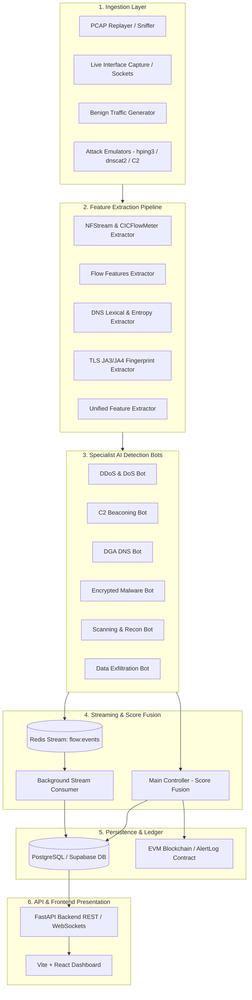

# 🛡️ AI-Powered Cyber Threat Detection System — Comprehensive Codebase Guide

This document provides a complete, file-by-file and architectural explanation of every component, module, dataset, script, and subsystem present in the `cyber-threat-detection` repository.

---

## 1. System Architecture & High-Level Overview

The **AI-Powered Cyber Threat Detection System** is an end-to-end security analytics and threat intelligence platform designed to ingest raw network traffic, extract statistical/cryptographic/lexical features, classify diverse attack vectors using specialist Machine Learning models, correlate and fuse predictions via a central controller, log alerts to a PostgreSQL/Supabase database and an immutable blockchain ledger, and visualize telemetry in real time.

---

## 2. Directory-by-Directory & File-by-File Breakdown

---

### A. Root Files

* **`README.md`**:
  * Comprehensive architectural documentation detailing the multi-layer pipeline (Ingestion, Specialist Bots, Redis Streaming, Controller Score Fusion, PostgreSQL/Supabase storage, Blockchain audit trail, and React dashboard).
  * Outlines team role distribution (Backend, ML, Frontend, Data/DevOps) and setup guides.
* **`docker-compose.yml`**:
  * Root convenience Compose orchestrator pointing to development and production microservices.
* **`.env.example`**:
  * Environment variable templates including `DATABASE_URL`, `SUPABASE_URL`, `SUPABASE_SERVICE_KEY`, `REDIS_URL`, `BLOCKCHAIN_RPC_URL`, and API ports.
* **`.gitignore`**:
  * Ignores bytecode (`__pycache__`), virtual environments (`.venv`, `env`), node modules, large binary PCAPs, database dumps, and environment secrets.

---

### B. Machine Learning Subsystem (`ai_models/`)

The `ai_models` directory contains the core intelligence of the system. It is structured around specialized feature extractors and 6 dedicated `SpecialistBot` models using `scikit-learn` Random Forests with balanced class weights and custom feature contracts.

#### 1. Common Layer (`ai_models/common/`)
* **`bot_base.py`**:
  * Defines the abstract base class `SpecialistBot` and dataclass `BotResult`.
  * **Unified Training/Inference Contract**: Enforces that both `fit()` and `predict()` pass through the same feature extractor to eliminate train/serve skew.
  * **Model Persistence**: Implements `save()` and `load()` using `joblib`, verifying that saved model artifacts match current feature extractors.
  * **Evaluation**: Computes classification reports, confusion matrices, and ROC-AUC scores on held-out test splits.
  * **Severity Mapping**: Automatically converts model prediction confidence and classification into standardized severities (`CRITICAL` $\ge 0.95$, `HIGH` $\ge 0.85$, `MEDIUM` $\ge 0.70$, `LOW` $< 0.70$).
* **`feature_base.py`**:
  * Abstract base class `BaseFeatureExtractor` requiring `extract(raw_data)` and `get_feature_names()`.
* **`model_registry.py`**:
  * Central dynamic model loader. Maps bot names (`ddos_bot`, `beaconing_bot`, `dga_dns_bot`, `encrypted_malware_bot`, `scanning_bot`, `exfiltration_bot`) to their respective classes and feature extractors.
  * Provides `load_bot(name, model_path)` and `load_all_bots(saved_models_dir)`.

#### 2. Feature Extraction Pipelines (`ai_models/features/`)
* **`extractor.py` (`UnifiedFeatureExtractor`)**:
  * Aggregates statistical flow features, DNS lexical metrics, and TLS cryptographic signatures into a single dictionary (60+ dimensions).
  * Includes `extract_for_db(raw_telemetry)` to format records directly for Supabase `network_flows` table schema.
* **`nfstream_extractor.py` (`NFStreamFeatureExtractor`)**:
  * Production-grade flow extractor compliant with the **NFStream** and **CICFlowMeter** standard (75+ metrics).
  * Computes:
    * Bidirectional packet/byte counters and duration.
    * Forward, backward, and bidirectional packet size statistics (min, mean, max, standard deviation).
    * Inter-Arrival Time (IAT) statistics (min, mean, max, std dev) for forward and backward directions.
    * TCP flag distribution counters (SYN, ACK, FIN, RST, PSH, URG).
    * Asymmetric byte/packet ratios and throughput rates (bytes/sec, packets/sec).
    * Integrated JA3 threat database lookups and Shannon payload entropy.
* **`flow_features.py` (`FlowFeatureExtractor`)**:
  * Extracts standard Layer 3 / Layer 4 flow characteristics: `duration`, `bytes_in`, `bytes_out`, `pkts_in`, `pkts_out`, `flow_rate_bps`, `packet_rate_pps`, `byte_ratio_out_in`, `pkt_ratio_out_in`, protocol flags (`is_tcp`, `is_udp`, `has_syn`, `has_ack`, `has_fin`, `has_rst`, `has_psh`), and payload entropy.
* **`dns_features.py` (`DNSFeatureExtractor`)**:
  * Analyzes DNS query hostnames for algorithmic anomalies (DGA, DNS tunneling).
  * Calculates: `domain_length`, `shannon_entropy`, `vowel_ratio`, `consonant_ratio`, `digit_ratio`, `special_char_ratio`, `subdomain_count`, `has_consecutive_consonants` (4+ consecutive consonants flag), `bigram_avg_frequency`, `payload_size_bytes`, and `is_txt_query`.
* **`tls_features.py` (`TLSFeatureExtractor`)**:
  * Extracts cryptographic metadata from encrypted TLS handshakes without decrypting payloads.
  * Computes `has_ja3`, checks against known malware JA3 hash signatures (Cobalt Strike, TrickBot, Emotet, AsyncRAT, Qakbot, Meterpreter), calculates `sni_length`, `cipher_suite_count`, and `encrypted_entropy`.

#### 3. Specialist Bots (`ai_models/bots/`)
Each bot directory contains `model.py`, `train.py`, and `predict.py`.

* **`ddos_bot/`**:
  * **Threat Focus**: TCP SYN floods, UDP reflection amplification, Slowloris HTTP exhaustion.
  * **Features**: `duration`, `total_packets`, `total_bytes`, `packets_per_second`, `bytes_per_second`, `bytes_per_packet`, `syn_ack_ratio`, `rst_ratio`, `unique_src_ports`.
  * **Model & Training**: Balanced Random Forest trained on synthetic flow variations with realistic packet bursts.
* **`beaconing_bot/`**:
  * **Threat Focus**: Command and Control (C2) heartbeat communications (e.g. Cobalt Strike, Sliver, Mythic implants).
  * **Features**: `mean_interval`, `std_interval`, `cv_interval` (coefficient of variation), `jitter_ratio`, `packet_count`, `session_span`.
  * **Key Intuition**: Human traffic is bursty (high CV / Poisson process); C2 beacons are strictly periodic with low jitter (low CV).
* **`dga_dns_bot/`**:
  * **Threat Focus**: Domain Generation Algorithms (DGA) used by malware to bypass hardcoded C2 domain blacklists.
  * **Features**: `length`, `entropy`, `digit_ratio`, `vowel_ratio`, `unique_char_ratio`, `max_consonant_run`, `subdomain_count`, `ngram_hit_ratio`.
* **`encrypted_malware_bot/`**:
  * **Threat Focus**: Malicious C2 hiding inside TLS/HTTPS connections without payload decryption.
  * **Features**: `cipher_suite_count`, `extension_count`, `handshake_duration_ms`, `session_duration`, `sni_length`, `packet_size_mean`, `packet_size_std`, `packet_count`.
  * **Key Intuition**: Malware TLS stacks have minimal cipher suites and fixed packet size distributions compared to standard browsers.
* **`scanning_bot/`**:
  * **Threat Focus**: Reconnaissance, vertical port sweeps (e.g., Nmap 1-1024), horizontal subnet sweeps.
  * **Features**: `unique_dst_ips`, `unique_dst_ports`, `targets_per_second`, `half_open_ratio` (SYN without ACK), `packets_per_target`, `duration`.
* **`exfiltration_bot/`**:
  * **Threat Focus**: Sensitive data theft via anomalous egress volume and DNS tunneling (large TXT records).
  * **Features**: `outbound_bytes`, `inbound_bytes`, `out_in_ratio`, `bytes_per_request`, `outbound_rate`, `dns_txt_avg_size`, `payload_entropy`.

---

### C. Backend Application (`backend/`)

The backend is built with **FastAPI**, **SQLAlchemy ORM**, **Alembic**, and **Redis Streams**.

#### 1. Core & Configuration
* **`backend/app/main.py`**:
  * FastAPI entry point configuring CORS middlewares for frontend origins (`http://localhost:5173`, production dashboard).
  * Mounts API route controllers (`/api/alerts`, `/api/bots`, `/api/flows`) and provides `/health` check.
* **`backend/alembic.ini` & `backend/alembic/`**:
  * Database migration configuration.
  * **`versions/a8bc5c95cf75_initial_schema.py`**: Complete migration script creating `network_flows`, `threat_alerts`, `bot_metrics`, `dga_domains`, and `dns_queries` tables with primary keys, unique constraints, and indexes.

#### 2. Database Layer (`backend/app/db/`)
* **`session.py`**:
  * Database engine initialization and session factory (`SessionLocal`), supporting PostgreSQL connection pooling and dependency injection (`get_db`).
* **`models.py`**:
  * SQLAlchemy relational models:
    * `NetworkFlow`: Stores 5-tuple flow telemetry, packet/byte counts, TCP flags, duration, rates, JA3 hashes, and ground truth labels.
    * `ThreatAlert`: Stores fused alerts (`alert_id`, `title`, `description`, `severity`, `confidence_score`, `contributing_bots`, `bot_scores`, `evidence`, `status`, `blockchain_tx_hash`, `blockchain_verified`, `blockchain_block_num`).
    * `BotMetric`: Tracks bot runtime metrics (`latency_ms`, `cpu_percent`, `memory_mb`, `predictions_count`, `threats_detected`, `accuracy_score`, `f1_score`, `last_heartbeat`).
    * `BlockchainLog`: On-chain proof records linking alert hashes to EVM block numbers, gas used, and transaction hashes.
    * `DGADomain` & `DNSQuery`: Domain classification and DNS tunneling query logs.
  * Implements custom `ArrayType` for cross-platform SQLite/PostgreSQL array compatibility.

#### 3. API Schemas & Routes (`backend/app/schemas/` & `backend/app/api/`)
* **`schemas/alert.py`**: Pydantic validation schemas (`ThreatAlertBase`, `ThreatAlertCreate`, `ThreatAlertUpdate`, `ThreatAlertResponse`).
* **`schemas/bot_result.py`**: Pydantic schemas for bot health telemetry (`BotMetricResponse`) and inference results (`BotInferenceResult`).
* **`schemas/flow.py`**: Pydantic schemas for network flow ingestion and querying (`NetworkFlowCreate`, `NetworkFlowResponse`).
* **`api/routes/alerts.py`**: REST endpoints for fetching alerts (`GET /alerts`, `GET /alerts/{alert_id}`), manual creation (`POST /alerts`), status updates (`PATCH /alerts/{alert_id}`), and deletion (`DELETE /alerts/{alert_id}`).
* **`api/routes/bots.py`**: Health endpoint (`GET /bots/health`) returning real-time latency, accuracy, and operational status of each specialist bot.
* **`api/routes/flows.py`**: Endpoints for querying flow history (`GET /flows`, `GET /flows/{flow_id}`) and ingesting new flows (`POST /flows`).

#### 4. Streaming & Controller (`backend/app/streaming/` & `backend/app/controller/`)
* **`redis_client.py`**: Initializes Redis client connection pool with auto-reconnection and timeouts.
* **`event_bus.py`**: Helper functions to publish flows to the `flow:events` Redis stream (`publish_flow_event`) and read event streams (`read_flow_events`).
* **`consumer.py`**:
  * Background worker listening to Redis stream `flow:events` under consumer group `backend_consumers`.
  * Persists incoming stream events into the `network_flows` table and acknowledges messages via `XACK`.
  * Runs a lightweight HTTP health server to maintain background worker status on cloud platforms.
* **`main_controller.py`**:
  * **Score Fusion Engine**: Queries active specialist bots via REST inference endpoints, checks predictions against confidence thresholds ($\ge 0.70$), and correlates multi-bot signals.
  * Synthesizes and writes new `ThreatAlert` records directly to the database when threats are detected.

---

### D. Data Subsystem & Synthetic Catalog (`data/`)

The `data/` subsystem contains synthetic dataset generators, dataset splitters, PCAP extractors, and database schemas.

* **`supabase_schema.sql`**:
  * Full PostgreSQL DDL script creating all 6 tables (`network_flows`, `threat_alerts`, `bot_metrics`, `blockchain_logs`, `dga_domains`, `dns_queries`) with UUID primary keys, B-tree indexes, check constraints, Row Level Security (RLS) policies, and Supabase Realtime publication grants.
* **`supabase_seed.sql`**:
  * Pre-populated SQL seed containing baseline bot metrics, threat alerts, and blockchain log records.
* **`generate_datasets.py`**:
  * Production-grade generative script creating synthetic attack flows across all 6 threat vectors (SYN flood, UDP amp, Slowloris, DNS tunneling, DGA queries, C2 beaconing, port scanning, encrypted malware, and data exfiltration).
  * Automatically generates `flows/sample_mixed_flows.json` (3,300 mixed flows: 80% benign, 20% threats) and exports binary PCAPs.
* **`preprocess_and_split.py`**:
  * Performs stratified sampling on `sample_mixed_flows.json` to generate balanced ML partitions:
    * `train.csv` / `train.json` (70% — 2,310 flows)
    * `val.csv` / `val.json` (15% — 494 flows)
    * `test.csv` / `test.json` (15% — 496 flows)
* **`pcap_to_flow.py`**:
  * Pure-Python, zero-dependency binary PCAP reader and flow aggregator. Parses Ethernet, IPv4, TCP, UDP, and ICMP frames into bidirectional 5-tuple flows with calculated durations, packet rates, byte counts, and TCP flags.
* **`validate_datasets.py`**:
  * Quality assurance and verification suite. Validates CSV/JSON syntax, schema consistency, IP address validity, port ranges (0-65535), duration positivity, and statistical balance.
* **`import_external_datasets.py`**:
  * Benchmark adapter that normalizes external academic datasets (CIC-IDS2017/2018, UNSW-NB15) into the system's standard schema.
* **`threat_intel/`**:
  * **`dgarchive_dga_generators.py`**: Mathematical reverse-engineered DGA implementations for 12 malware families (*Cryptolocker, Necurs, Banjori, Suppobox, Mirai, Matsnu, Locky, Tinba, Ramdo, Rovnix, Pykspa, Ranbyus*).
  * **`ja3_malware_database.json`**: Catalog of known malware JA3 hashes mapped to threat names and malware families.
  * **`benign_top_domains.json`**: Alexa/Tranco top benign domain distribution used for baseline calibration.
* **`seed_supabase.py`**:
  * Automated Python seeder capable of populating Supabase via PostgREST REST API, direct PostgreSQL connection, or SQL output.

---

### E. Scripts & Traffic Emulators (`scripts/`)

* **`c2_beacon_emulator.py`**:
  * Simulates realistic Command & Control (Cobalt Strike / Sliver) heartbeats with configurable sleep intervals, Gaussian/Laplace jitter ($\pm 15\%$ to $\pm 40\%$), malleable payload sizes, and Cobalt Strike JA3 signatures.
* **`dnscat2_tunnel_emulator.py`**:
  * Simulates dnscat2 and iodine DNS tunneling. Chunks payloads into Base32/Base64 subdomains across TXT, A, and CNAME queries with high Shannon entropy ($> 4.2$).
* **`hping3_simulator.py`**:
  * High-throughput flood simulator for TCP SYN floods (randomized botnet source IPs, zero ACKs), UDP reflection amplification (DNS/NTP reflectors with 35x-70x amplification), and vertical/horizontal port scans.
* **`benign_traffic_generator.py`**:
  * Generates normal enterprise traffic modeling authentic corporate networks: heavy-tailed Pareto byte distributions, Poisson packet arrivals, mixed protocols (HTTPS, HTTP, DNS, SSH, NTP, SMTP), and genuine browser JA3 hashes.
* **`generate_attacks.sh` & `generate_benign_traffic.sh`**:
  * Bash scripts to trigger attack emulations and benign baseline generation pipelines.

---

### F. Frontend & Infrastructure Blueprints (`frontend/`, `infra/`, `docs/`)

* **`frontend/`**:
  * Designed as a modern Single-Page Application (SPA) using **Vite + React + TypeScript + Tailwind CSS**.
  * Contains architectural scaffolding for:
    * **`Dashboard.tsx`**: Live threat overview, KPI metric cards, and attack distribution charts.
    * **`AlertDetail.tsx`**: Deep forensic view showing packet evidence, contributing bot confidence scores, and blockchain transaction verification.
    * **`SystemHealth.tsx`**: Telemetry on bot container latencies, CPU/memory consumption, and pipeline throughput.
    * **`ThroughputChart.tsx` & `ThreatClassChart.tsx`**: Visual chart components for flows/sec and attack categories.
    * **`useAlerts.ts`**: Custom React hook for live WebSocket alert streaming.
* **`infra/`**:
  * Kubernetes manifests (`infra/k8s/`) for the currently configured namespace, backend deployment, shared configuration, and secrets.
  * The root `docker-compose.yml` provides the local backend, Redis, and frontend stack.
* **`docs/`**:
  * Specification blueprints outlining architecture, bot specs, feature engineering, alert schemas, blockchain smart contract designs, and demo workflows.

---

## 3. Summary of Threat Vectors & Machine Learning Architecture

| Threat Vector | Specialist Bot | Primary Feature Signals | Detection Technique |
| :--- | :--- | :--- | :--- |
| **DDoS / Floods** | `ddos_bot` | Packets/sec, bytes/sec, SYN-to-ACK ratio, RST ratio | Random Forest classifier on flow rate bursts & asymmetric TCP flags |
| **C2 Beaconing** | `beaconing_bot` | Inter-arrival time mean, std dev, coefficient of variation (CV), jitter | Statistical timing regularity & low CV analysis |
| **DGA Hostnames** | `dga_dns_bot` | Shannon entropy, vowel/consonant ratios, consonant runs, n-gram hits | Lexical & information-theoretic string classification |
| **Encrypted Malware** | `encrypted_malware_bot` | JA3 hash lookup, cipher suite count, SNI length, packet size variance | Cryptographic fingerprinting & TLS handshake behavior |
| **Network Scanning** | `scanning_bot` | Unique destination IPs/ports, targets/sec, half-open SYN ratio | Horizontal/vertical fan-out and scan velocity detection |
| **Data Exfiltration** | `exfiltration_bot` | Outbound-to-inbound byte ratio, DNS TXT size, payload entropy | Egress volumetric anomaly & DNS covert channel detection |

---

## 4. Key Takeaways

1. **Clean Separation of Concerns**: Ingestion $\rightarrow$ Feature Engineering $\rightarrow$ Specialist Bot Classification $\rightarrow$ Redis Streaming $\rightarrow$ Controller Score Fusion $\rightarrow$ Database/Blockchain Persistence $\rightarrow$ Dashboard.
2. **Zero Train/Serve Skew**: All feature extractors subclass `BaseFeatureExtractor`, ensuring identical feature vectors during model training and live runtime inference.
3. **Multi-Bot Score Fusion**: Individual bot predictions are correlated by the main controller before an alert is promoted to `CRITICAL` or committed to the database and blockchain ledger.
4. **Rich Synthetic Threat Ecosystem**: Includes authentic threat intelligence feeds (JA3 databases, reverse-engineered DGArchive algorithms) and realistic traffic emulators for testing without live malware execution.
