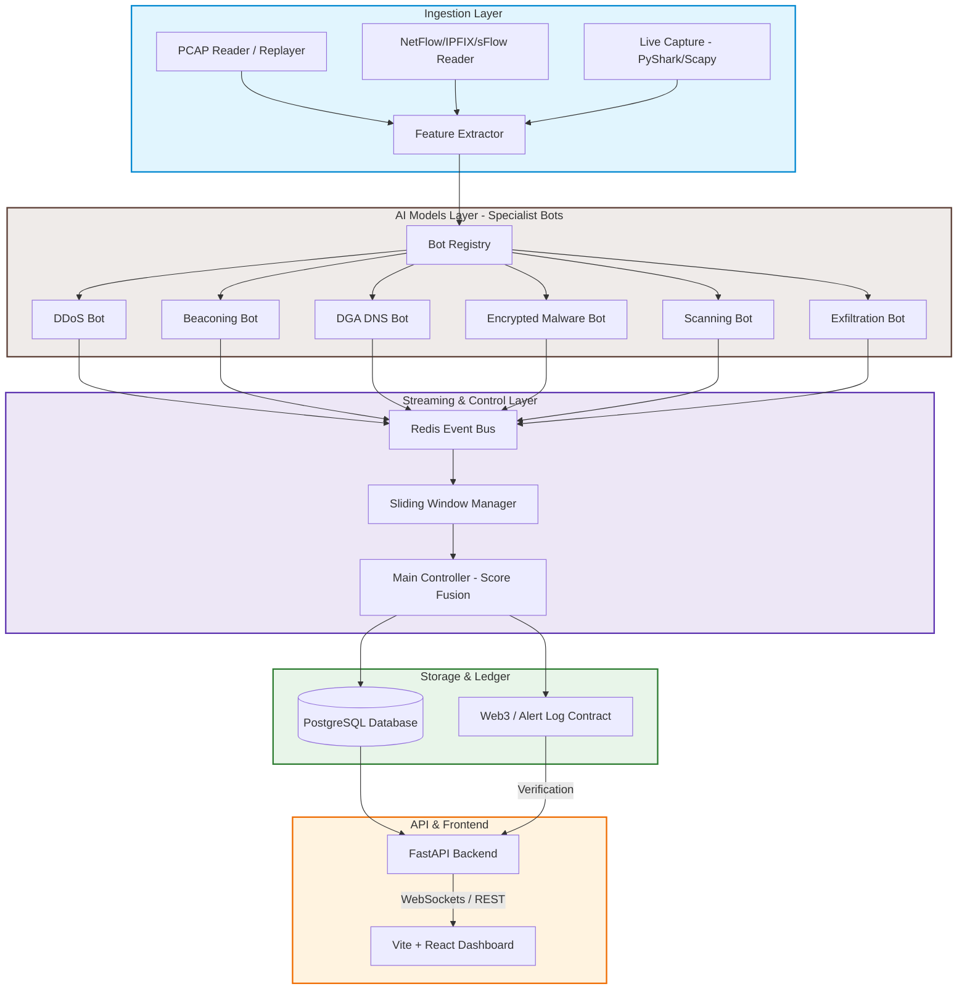

# 🛡️ AI-Powered Cyber Threat Detection System

Welcome to the **AI-Powered Cyber Threat Detection System** project repository. This multi-layered platform is engineered to ingest high-throughput network traffic, process data stream aggregates, perform specialist machine-learning classification on diverse vectors (DDoS, Beaconing, DGA DNS, Encrypted Malware, Scanning, and Exfiltration), coordinate score fusion to establish final threat alerts, commit cryptographically secure audit logs to a blockchain network, and display real-time telemetry on an interactive security dashboard.

---

## 🏗️ System Architecture & Data Flow

The diagram below outlines the system's runtime architecture, displaying how packet/flow ingestion connects to feature pipelines, streaming pipelines, ML model predictions, decision coordination, database logging, smart contracts, and real-time visualization:



---

## 📂 Project Directory Structure

Below is the created file tree indicating the specific responsibilities of each file and module:

```directory
cyber-threat-detection/
├── backend/                                # Backend Application (FastAPI, DB, Blockchain)
│   ├── app/
│   │   ├── __init__.py
│   │   ├── main.py                         # FastAPI application entrypoint
│   │   ├── config.py                       # Configuration & Environment loading
│   │   ├── api/
│   │   │   ├── __init__.py
│   │   │   ├── routes/                     # API route handlers
│   │   │   │   ├── alerts.py               # REST & WebSocket endpoints for alerts
│   │   │   │   ├── flows.py                # CRUD / Query endpoints for network flows
│   │   │   │   ├── bots.py                 # Bot registration, status, and health checks
│   │   │   │   ├── mode.py                 # Endpoint to switch between live & prerecorded replay
│   │   │   │   └── blockchain.py           # Endpoint to verify alerts on-chain
│   │   │   └── deps.py                     # FastAPI dependency injection (DB sessions, authentication)
│   │   ├── ingest/                         # Ingestion engine
│   │   │   ├── __init__.py
│   │   │   ├── pcap_reader.py              # Ingests & processes static PCAP files
│   │   │   ├── flow_reader.py              # Parses NetFlow, IPFIX, sFlow records
│   │   │   ├── live_capture.py             # Captures live packets from network interfaces
│   │   │   └── replay_engine.py            # Manages time-accurate packet/flow replaying
│   │   ├── streaming/                      # Event streaming & message buffering
│   │   │   ├── __init__.py
│   │   │   ├── redis_client.py             # Connection pool & client interface for Redis
│   │   │   ├── window_manager.py           # Computes sliding window aggregations over network flows
│   │   │   └── event_bus.py                # Pub/sub broker routing events to/from AI models
│   │   ├── controller/                     # Brain of the backend
│   │   │   ├── __init__.py
│   │   │   ├── main_controller.py          # Score fusion algorithm combining multi-bot results
│   │   │   └── bot_registry.py             # Dynamically loads and tracks active AI models
│   │   ├── db/                             # Relational database persistence
│   │   │   ├── __init__.py
│   │   │   ├── models.py                   # SQLAlchemy schema definition models
│   │   │   ├── session.py                  # Database connection pool & transaction manager
│   │   │   └── crud.py                     # DB helpers for CRUD operations (create, read, update, delete)
│   │   ├── blockchain/                     # Immutable tamper-proof audit trail
│   │   │   ├── __init__.py
│   │   │   ├── web3_client.py              # Interacts with EVM-compatible blockchains via Web3.py
│   │   │   ├── hasher.py                   # Computes cryptographic hashes of alerts
│   │   │   └── contracts/
│   │   │       └── AlertLog.sol            # Solidity Smart Contract for on-chain alert logging
│   │   ├── schemas/                        # Pydantic data serialization schemas
│   │   │   ├── __init__.py
│   │   │   ├── alert.py                    # Input/output validation for alerts
│   │   │   ├── flow.py                     # Schema validation for incoming network flows
│   │   │   └── bot_result.py               # Schema validation for individual bot responses
│   │   └── utils/
│   │       ├── __init__.py
│   │       ├── logger.py                   # Custom logger for unified console & file logging
│   │       └── metrics.py                  # Ingestion & evaluation throughput stats
│   ├── tests/                              # Backend test suite
│   │   ├── test_ingest.py                  # Unit tests for flow & packet signatures
│   │   ├── test_api.py                     # Integration tests for FastAPI endpoints
│   │   └── test_blockchain.py              # Integration tests for on-chain log verification
│   ├── alembic/                            # Relational database migrations
│   │   └── versions/                       # DB schema migration history scripts
│   ├── requirements.txt                    # Backend Python dependencies
│   ├── Dockerfile                          # Containerization configuration for FastAPI app
│   └── .env.example                        # Template for environment variables (DB URLs, API keys)
│
├── ai_models/                              # AI & Machine Learning Subsystem
│   ├── common/
│   │   ├── __init__.py
│   │   ├── feature_base.py                 # Abstract base class for feature pipelines
│   │   ├── bot_base.py                     # Abstract SpecialistBot class declaring predict/train interface
│   │   └── model_registry.py               # Dynamically instantiates models
│   ├── features/
│   │   ├── __init__.py
│   │   ├── flow_features.py                # Extracts standard flow characteristics (duration, bytes/pkt)
│   │   ├── dns_features.py                 # Extracts DNS entropy, character frequency, n-gram details
│   │   ├── tls_features.py                 # Extracts JA3/JA4 fingerprinting, timing, and size sequences
│   │   └── extractor.py                    # Wrapper around nfstream, Scapy, or PyShark
│   ├── bots/                               # Specialist Bot ML models
│   │   ├── ddos_bot/                       # Detects DDoS & DoS attacks (SYN floods, UDP amplification)
│   │   │   ├── model.py
│   │   │   ├── train.py
│   │   │   └── predict.py
│   │   ├── beaconing_bot/                  # Identifies beaconing patterns indicative of C2 command channels
│   │   │   ├── model.py
│   │   │   ├── train.py
│   │   │   └── predict.py
│   │   ├── dga_dns_bot/                    # Detects Domain Generation Algorithms (DGA) in DNS queries
│   │   │   ├── model.py
│   │   │   ├── train.py
│   │   │   └── predict.py
│   │   ├── encrypted_malware_bot/          # Detects malware signatures in encrypted payloads (TLS/HTTPS)
│   │   │   ├── model.py
│   │   │   ├── train.py
│   │   │   └── predict.py
│   │   ├── scanning_bot/                   # Detects host discovery and port scanning activities
│   │   │   ├── model.py
│   │   │   ├── train.py
│   │   │   └── predict.py
│   │   └── exfiltration_bot/               # Detects data exfiltration (DNS tunnels, anomalous outbound bytes)
│   │       ├── model.py
│   │       ├── train.py
│   │       └── predict.py
│   ├── saved_models/                       # Local model binary registry (.pkl, .json, .pt)
│   │   └── .gitkeep
│   └── requirements.txt                    # ML dependencies (numpy, pandas, scikit-learn, nfstream, etc.)
│
├── frontend/                               # Single-page Application dashboard
│   ├── src/
│   │   ├── main.tsx                        # React application bootstrapper
│   │   ├── App.tsx                         # Core app router & layout wrapper
│   │   ├── api/
│   │   │   └── client.ts                   # HTTP & WebSocket API client
│   │   ├── components/                     # Reusable React components
│   │   │   ├── AlertsTable/                # Displays list of alerts with filtering and sorting
│   │   │   ├── EvidencePanel/              # Shows packet/flow logs backing a specific alert
│   │   │   ├── SeverityBadge/              # Renders visual priority (Low, Medium, High, Critical)
│   │   │   ├── BotHealthPanel/             # Displays CPU, memory, and prediction latency of ML bots
│   │   │   ├── ModeToggle.tsx              # Button/switch to toggle backend mode (Live vs Replay)
│   │   │   └── ChatWithAI/                 # LLM-powered interactive security analyst interface
│   │   ├── pages/                          # Primary views
│   │   │   ├── Dashboard.tsx               # High-level threat intelligence dashboard
│   │   │   ├── AlertDetail.tsx             # Deep dive on alert forensic data & on-chain verification
│   │   │   └── SystemHealth.tsx            # Monitors throughput metrics & bot container logs
│   │   ├── charts/                         # Dynamic visualization components
│   │   │   ├── ThroughputChart.tsx         # Real-time flows/sec line chart
│   │   │   └── ThreatClassChart.tsx        # Doughnut/Bar chart showing breakdown of attack categories
│   │   ├── hooks/                          # Custom React Hooks
│   │   │   └── useAlerts.ts                # Real-time WebSocket hook receiving alerts
│   │   ├── types/
│   │   │   └── alert.ts                    # TypeScript types matching Pydantic schemas
│   │   └── styles/
│   │       └── index.css                   # Global styles & Tailwind CSS imports
│   ├── public/                             # Static assets (favicons, images)
│   ├── index.html                          # Root HTML template
│   ├── package.json                        # Node.js project manifests & scripts
│   ├── tailwind.config.ts                  # Utility class declarations & theme configuration
│   ├── vite.config.ts                      # Bundling optimizations & dev server setup
│   ├── tsconfig.json                       # TypeScript compiler options
│   └── Dockerfile                          # Multi-stage build for frontend production distribution
│
├── infra/                                  # Deployment Configurations
│   └── k8s/                                # Kubernetes manifests
│       ├── namespace.yaml                  # Isolates resources into `cyber-threat-detection`
│       ├── backend-deployment.yaml         # Configures FastAPI replica sets and pod definitions
│       ├── configmap.yaml                  # Application configuration variables (non-sensitive)
│       └── secrets.yaml                    # Encrypted db passwords and blockchain keys
│
├── data/                                   # Datasets repository
│   ├── pcaps/                              # Raw network packet captures (gitignored)
│   │   └── .gitkeep
│   ├── flows/                              # Extracted CSV or JSON flow datasets (gitignored)
│   │   └── .gitkeep
│   ├── synthetic/                          # Generative test datasets
│   │   ├── benign/                         # Baseline traffic containing no malicious vectors
│   │   └── attacks/                        # Malicious traffic organized by vector
│   │       ├── syn_flood/                  # Synthetic TCP SYN flood data
│   │       ├── udp_amplification/          # DNS/NTP reflection simulation logs
│   │       ├── slowloris/                  # Low-and-slow HTTP depletion events
│   │       ├── dns_tunneling/              # C2 packets disguised inside DNS Queries
│   │       ├── dga_samples/                # DGA domain names list
│   │       └── c2_beaconing/               # Consistent time-interval communication flows
│   └── README.md                           # Documentation on dataset collection, source links, and generation steps
│
├── scripts/                                # Maintenance & Testing Utilities
│   ├── generate_benign_traffic.sh          # Simulates benign users using iperf3/Ostinato/TRex
│   └── generate_attacks.sh                 # Simulates attacks using hping3, dnscat2, or iodine
│
├── docs/                                   # Detailed Technical Specifications
│   ├── architecture.md                     # Component design patterns, state diagrams & flow charts
│   ├── bot_specs.md                        # Model inputs, hyperparameters, thresholds, and performance targets
│   ├── feature_engineering.md              # Documentation on extracted metrics, normalizations & transforms
│   ├── alert_schema.md                     # JSON/SQL schemas detail, data normalization strategy
│   ├── blockchain_design.md                # Smart contract layout, gas estimation, consensus proof validation
│   ├── demo_script.md                      # Step-by-step guidelines for executing the threat-detection demo
│   └── team_workflow.md                    # Git branching guidelines, code review expectations, and release lifecycle
│
├── .github/                                # Continuous Integration (CI/CD)
│   └── workflows/
│       ├── backend-ci.yml                  # Lints, builds, and runs Pytest for backend code
│       ├── frontend-ci.yml                 # Runs ESLint, TypeScript compilation, and Vite builds
│       └── ai-models-ci.yml                # Validates Python ML code and verifies unit test results
│
├── .gitignore                              # Excludes credentials, saved model binaries, dataset folders, etc.
├── .env.example                            # Configuration environment template for workspace root
├── docker-compose.yml                      # Local backend, Redis, and frontend stack
└── README.md                               # This documentation file
```

---

## 🔗 Component Connectivity & Operational Flow

The cyber-threat detection system relies on smooth interactions across five specialized layers: **Ingestion, ML Feature & Specialist Bot Inference, Event Streaming, Decision Orchestration, and Presentation/Ledger Persistence**.

### 1. Ingestion Layer (`backend/app/ingest/` & `scripts/`)
* **Purpose**: Capture or simulate raw network telemetry.
* **Component Interactions**:
  * In **Live Mode**, `live_capture.py` captures traffic directly from local interfaces (using raw sockets, Scapy, or PyShark bindings). 
  * In **Replay Mode**, `replay_engine.py` opens packet files stored inside `data/pcaps/` and replays them programmatically, reproducing original arrival times.
  * In either mode, raw frames or flows are formatted and forwarded directly to the **AI Models Feature Extractor**.
  * The scripts `generate_benign_traffic.sh` and `generate_attacks.sh` automate traffic synthesis during development, outputting capture data into the `data/synthetic/` sub-directories.

### 2. Feature Extractor & Specialist ML Bots (`ai_models/`)
* **Purpose**: Parse raw telemetry into numerical metrics and classify attack vectors.
* **Component Interactions**:
  * `ai_models/features/extractor.py` handles the translation of raw packet payloads/headers into high-level features.
  * It passes basic network traffic flow statistics to `flow_features.py`, DNS query parameters to `dns_features.py`, and TLS handshake strings (JA3/JA4 fingerprints) to `tls_features.py`.
  * The processed vectors inherit interfaces from `common/feature_base.py` and are routed by `common/model_registry.py` to the relevant **Specialist Bots** (`ai_models/bots/`):
    * `ddos_bot`: Monitors connection frequency, ratio of TCP flags (like SYN-to-ACK ratios), and packet volume thresholds.
    * `beaconing_bot`: Analyzes time intervals between client-server packets to identify periodic callback patterns.
    * `dga_dns_bot`: Evaluates character entropy, vowel ratios, and n-gram characteristics of requested DNS hostnames.
    * `encrypted_malware_bot`: Observes JA3/JA4 cryptographic fingerprints, protocol headers, and packet size distributions to detect command-and-control channels within TLS streams.
    * `scanning_bot`: Tracks unique destination IP/port targets hit by a single source over sliding windows to flag scanners.
    * `exfiltration_bot`: Computes total outbound byte volume ratios and flags payload anomalies (such as large payloads stuffed inside DNS TXT records).
  * The bots output standardized prediction responses matching the backend's validation definitions (`backend/app/schemas/bot_result.py`).

### 3. Event Streaming & Window Management (`backend/app/streaming/`)
* **Purpose**: Buffers rapid-fire model predictions and aggregates network behavior over time.
* **Component Interactions**:
  * Bot predictions are pushed to the **Redis Client** (`redis_client.py`) acting as a low-latency pub/sub event bus (`event_bus.py`).
  * Because single-packet checks can yield false alarms, the `window_manager.py` manages sliding windows (e.g., aggregating alerts over 5, 10, or 60-second periods).
  * Aggregated streams are then pushed to the main system controller.

### 4. Main Controller & Score Fusion (`backend/app/controller/`)
* **Purpose**: Combines separate specialist bot alerts into a unified threat response.
* **Component Interactions**:
  * `main_controller.py` executes score fusion models. For example, if the `dga_dns_bot` fires a minor flag, the `exfiltration_bot` flags anomalous DNS volume, and the `beaconing_bot` flags consistent callbacks, the fusion controller correlates these events to issue a high-severity **Command & Control / Data Exfiltration** alert.
  * The controller references `bot_registry.py` to track which bots are currently online, healthy, and participating in the consensus vote.

### 5. API, Storage, & Ledger Persistence (`backend/app/db/` & `backend/app/blockchain/`)
* **Purpose**: Persist records for real-time visualization and cryptographically guarantee compliance.
* **Component Interactions**:
  * Once a fused alert is generated:
    1. **Relational Save**: `db/crud.py` commits the alert data (matching `schemas/alert.py`) to the PostgreSQL database through `db/session.py`.
    2. **On-Chain Log**: To secure the audit trail, `blockchain/hasher.py` hashes the alert payload. The `blockchain/web3_client.py` signs a transaction sending this hash to the EVM contract `AlertLog.sol`, protecting the record from subsequent tampering.
    3. **Websocket Push**: The event is pushed immediately to active frontend clients over WebSockets in `api/routes/alerts.py`.

### 6. Presentation Layer (`frontend/`)
* **Purpose**: Human-in-the-loop threat response dashboard.
* **Component Interactions**:
  * `frontend/src/api/client.ts` manages connection handshakes for HTTP endpoints and WebSocket feeds.
  * The custom hook `useAlerts.ts` streams events into state variables, rendering the tables (`AlertsTable/`) and dynamic widgets.
  * `ThroughputChart.tsx` plots current packet ingestion speeds using metrics exposed by `backend/app/utils/metrics.py`.
  * `ThreatClassChart.tsx` categorizes and graphs threat types in real-time.
  * `ModeToggle.tsx` lets analysts toggle `mode.py` on the backend, switching between replaying old PCAPs and monitoring live interface cards.
  * `ChatWithAI/` provides an interactive prompt, queryable via LLM, allowing analysts to search logs, examine forensic evidence (`EvidencePanel/`), and verify on-chain hashes (`AlertDetail.tsx`).

---

## 🔒 Team Workflow & Roles

* **Person 1 (Backend Engineering)**: Owns the `backend/app/` folder, including API routing, database schema persistence (`db/`), streaming queues (`streaming/`), the blockchain verification architecture (`blockchain/`), configuration, and Pytest coverage (`tests/`).
* **Person 2 (Machine Learning)**: Owns the `ai_models/` folder, implementing feature engineering (`features/`), model base definitions (`common/`), training/prediction scripts for the specialist bots (`bots/`), and exploratory notebooks (`notebooks/`).
* **Person 3 (Frontend Engineering)**: Owns the `frontend/` folder, building page routes (`pages/`), charts (`charts/`), state hooks (`hooks/`), design tokens (`styles/`), and reusable views (`components/`).
* **Person 4 (Data, Orchestration, & Documentation)**: Coordinates dataset assembly (`data/`), data-generation shell utilities (`scripts/`), Kubernetes/Compose orchestration configs (`infra/`), and technical systems documentation (`docs/`).
