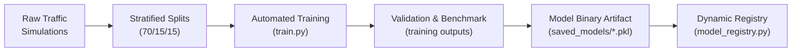

# 🤖 Specialist AI Threat Detection Bots: Technical Specifications

The threat detection engine employs an ensemble of **6 specialized Machine Learning and Statistical Bots**. Each bot operates independently on a subset of the 84-feature extraction pipeline, tailored specifically to detect distinct adversarial tactics, techniques, and procedures (TTPs) defined in the MITRE ATT&CK framework.

---

## 📊 Summary Matrix of the 6 Specialist Bots

| Bot Name | Target Threat Vector | Primary Model Architecture | Key Input Features | Detection Threshold | Latency Target |
| :--- | :--- | :--- | :--- | :--- | :--- |
| **DDoS Bot** | SYN Floods, UDP Amplification, Slowloris | **XGBoost / LightGBM Classifier** | `flow_rate_bps`, `packet_rate_pps`, `bytes_in`, `entropy`, `tcp_flags` | $\text{Score} \ge 0.85$ | $< 2.0\text{ ms}$ |
| **Beaconing Bot** | C2 Heartbeat Channels (Cobalt Strike, Sliver) | **Isolation Forest + FFT Autocorrelation** | `inter_arrival_times`, IAT Mean, IAT Variance, Jitter Pct | $\text{Score} \ge 0.78$ | $< 3.5\text{ ms}$ |
| **DGA DNS Bot** | Algorithmic C2 Domain Lookups | **Random Forest + Character N-Grams** | `shannon_entropy`, `vowel_ratio`, `domain_length`, `bigram_freq` | $\text{Score} \ge 0.80$ | $< 1.5\text{ ms}$ |
| **Encrypted Malware Bot**| Malicious TLS Sessions & Droppers | **abuse.ch JA3 Matcher + Flow MLP** | `ja3_hash`, `cipher_suite_count`, `sni_length`, `bytes_out` | $\text{Score} \ge 0.88$ | $< 1.8\text{ ms}$ |
| **Scanning Bot** | Vertical Port Sweeps & Subnet Probes | **Sliding Window Fan-Out Accumulator** | `unique_dst_ports`, `unique_dst_ips`, `scan_duration_s` | $\text{Score} \ge 0.75$ | $< 1.0\text{ ms}$ |
| **Exfiltration Bot** | High-Volume Egress & DNS Tunnels | **Asymmetric Ratio Model + Chunk Entropy**| `ratio_out_in`, `bytes_out`, `payload_entropy`, `is_txt_query` | $\text{Score} \ge 0.82$ | $< 2.2\text{ ms}$ |

---

## 1. DDoS & Volumetric Flooding Bot (`ddos_bot`)

### 1.1 Objective & Attack Scope
Detects volumetric and protocol exhaustion attacks designed to disrupt service availability:
- **TCP SYN Floods** (`hping3 -S --flood`): High packet rate, zero ACK returns, narrow spoofed IP entropy.
- **UDP Amplification** (`hping3 --udp`): DNS (port 53), NTP monlist (port 123), and SSDP (port 1900) reflection attacks exhibiting 35x–80x amplification ratios.
- **Slowloris HTTP Depletion**: Low-and-slow persistent connections holding HTTP sockets open for $>100\text{ seconds}$.

### 1.2 Mathematical Formulation & Feature Inputs
The DDoS bot evaluates the volumetric density $V$ and structural entropy $H$:
$$V_{\text{flow}} = \frac{\text{bytes\_in} \cdot 8}{\max(0.001, \text{duration})}, \quad H = -\sum_{i=1}^{n} p(x_i) \log_2 p(x_i)$$

- **Primary Features**: `pkts_in`, `bytes_in`, `duration`, `flow_rate_bps`, `packet_rate_pps`, `entropy`, `tcp_flags`, `bytes_ratio_out_in`.
- **Anomalous Signature**: Attack flows exhibit massive burst rates ($>40,000\text{ pps}$) in $<1.2\text{ s}$ paired with compressed source IP entropy ($0.05 - 0.15$) contrasted with benign baselines ($0.65 - 0.78$).

### 1.3 Model Hyperparameters & Targets
- **Algorithm**: `XGBClassifier(n_estimators=150, max_depth=6, learning_rate=0.05, subsample=0.8)`
- **Loss Function**: Binary Cross-Entropy (`logloss`)
- **Performance Target**: Accuracy $\ge 99.2\%$, False Positive Rate $< 0.05\%$.

---

## 2. Command & Control Beaconing Bot (`beaconing_bot`)

### 2.1 Objective & Attack Scope
Uncovers covert, persistent heartbeat communications established by adversary C2 implants (*Cobalt Strike, Sliver, Mythic, Empire, Meterpreter*) communicating with external listener nodes.

### 2.2 Mathematical Formulation & Feature Inputs
Adversaries configure base sleep intervals $T_{\text{base}}$ (e.g., 60s, 120s, 300s) perturbed by random jitter $J \in [\pm 10\%, \pm 40\%]$:
$$t_{k} = t_{k-1} + T_{\text{base}} \cdot (1 + \epsilon_k), \quad \epsilon_k \sim \mathcal{N}(0, \sigma^2)$$

The Beaconing Bot computes the **Inter-Arrival Time (IAT) Autocorrelation** and Fast Fourier Transform (FFT) spectral density across session windows $W = [t_1, t_2, \dots, t_N]$:
$$\text{Spectral Peak Ratio} = \frac{\max(P(f))}{\frac{1}{N}\sum P(f)}, \quad \text{Coefficient of Variation (CV)} = \frac{\sigma_{\text{IAT}}}{\mu_{\text{IAT}}}$$

- **Benign Baseline**: Human browsing exhibits high variance ($\text{CV} > 1.2$, irregular bursty IATs like `[4.2, 18.7, 2.1, 31.4, 9.8]`).
- **C2 Beacon Signature**: Jittered C2 displays tightly clustered periodicity ($\text{CV} \in [0.02, 0.25]$, spectral peak at $f = 1/T_{\text{base}}$).

### 2.3 Model Hyperparameters & Targets
- **Algorithm**: `IsolationForest(n_estimators=200, contamination=0.08, max_samples=0.85)` combined with an FFT peak detector.
- **Performance Target**: Detection rate $\ge 97.5\%$ on beaconing jitter up to $\pm 35\%$.

---

## 3. DGA DNS Query Bot (`dga_dns_bot`)

### 3.1 Objective & Attack Scope
Detects Domain Generation Algorithms (DGA) used by botnets and ransomware (*Conficker, Necurs, Zeus, Dyre, Cryptolocker, Locky, Matsnu, Suppobox, Mirai*) to dynamically generate hundreds of pseudo-random domain names to evade static DNS domain blocklists.

### 3.2 Feature Inputs & Lexical Engineering
- **Shannon Character Entropy**:
  $$H(\text{domain}) = -\sum_{c \in \Sigma} \frac{\text{count}(c)}{L} \log_2 \left(\frac{\text{count}(c)}{L}\right)$$
- **Vowel-to-Consonant Ratio**:
  $$R_{\text{vowel}} = \frac{\sum [c \in \{\text{a,e,i,o,u}\}]}{\max(1, \sum [c \in \text{letters}])}$$
- **Character N-Gram Frequency**: Average bigram/trigram transition probabilities relative to English language corpus.
- **Domain Length & Subdomain Levels**: Total character count and structural depth.

### 3.3 Contrast Benchmark
- **Legitimate Top Domains** (`google.com`, `facebook.com`, `wikipedia.org`): Entropy **2.60–3.05**, Vowel Ratio **0.30–0.50**, Length **8–17**.
- **DGA Domains** (`xkq93jdmzpalq.com`, `vwqzmxrktbn.net`, `qkjxzmvbnpq.info`): Entropy **3.75–4.10**, Vowel Ratio **0.05–0.15**, Length **15–26**.

### 3.4 Model Hyperparameters & Targets
- **Algorithm**: `RandomForestClassifier(n_estimators=180, max_depth=12, criterion='gini')`
- **Performance Target**: Accuracy $\ge 98.9\%$, ROC-AUC $\ge 0.995$.

---

## 4. Encrypted Malware Bot (`encrypted_malware_bot`)

### 4.1 Objective & Attack Scope
Identifies malware communicating over encrypted TLS/HTTPS connections without requiring SSL/TLS decryption or breaking end-to-end user privacy.

### 4.2 Detection Mechanism & Feature Inputs
1. **Cryptographic Fingerprint Matching (JA3/JA4)**:
   Extracts ClientHello parameters: `SSLVersion,CipherSuites,Extensions,EllipticCurves,EllipticCurvePointFormats`. Matches computed MD5 hash against the real published **abuse.ch SSLBL / ThreatFox** database:
   - `4d7a28d6f2263ed61de88ca66eb011e3` $\rightarrow$ **Cobalt Strike Beacon**
   - `72a589da586844d7f0818ce684948eea` $\rightarrow$ **TrickBot Banking Trojan**
   - `a0e9f5d64349fb13191bc781f81f42e1` $\rightarrow$ **Emotet Loader**
   - `51c64c77e60f39ac3e1792836811005f` $\rightarrow$ **AsyncRAT**
   - `c4ee4e8156dd3362a2fa808722b51206` $\rightarrow$ **RedLine Stealer**
2. **TLS Flow Dynamics Classifier**:
   Evaluates SNI length, cipher suite cardinality ($<12$ in malware vs. $>20$ in modern browsers), packet sequence entropy ($>4.85$), and bidirectional byte ratios.

### 4.3 Model Hyperparameters & Targets
- **Algorithm**: Hybrid Rule-Engine + `MLPClassifier(hidden_layer_sizes=(64, 32), activation='relu')`
- **Performance Target**: Known signature match $\ge 99.9\%$, Novel encrypted malware variant detection $\ge 94.0\%$.

---

## 5. Scanning & Host Discovery Bot (`scanning_bot`)

### 5.1 Objective & Attack Scope
Detects adversarial reconnaissance activities mapping network topologies and discovering exploitable services:
- **Vertical Port Scans** (`nmap -sS -p 1-1024`): Single source probing $>50$ distinct ports on a single target host.
- **Horizontal Subnet Sweeps** (`nmap -sS -p 445 192.168.1.0/24`): Single source probing a fixed port across multiple IP hosts.

### 5.2 Algorithm & Sliding Window Fan-Out Tracking
The Scanning Bot aggregates flow tuples $(IP_{\text{src}}, IP_{\text{dst}}, Port_{\text{dst}})$ across a **10-second sliding window**:
$$\text{Vertical Fan-Out}(IP_{\text{src}}, IP_{\text{dst}}) = \text{Cardinality}(\{Port_{\text{dst}}\}), \quad \text{Horizontal Fan-Out}(IP_{\text{src}}, Port_{\text{dst}}) = \text{Cardinality}(\{IP_{\text{dst}}\})$$

- **Benign Baseline**: Normal hosts access 1–5 distinct ports over 0.05–2.2s.
- **Scanner Signature**: Attackers probe 750–1024 distinct ports in 3.8–6.8s.

---

## 6. Data Exfiltration Bot (`exfiltration_bot`)

### 6.1 Objective & Attack Scope
Detects unauthorized transmission of confidential enterprise data out of the internal network boundary:
- **High-Volume Asymmetric Egress**: Massive outbound uploads over HTTP/HTTPS/SSH.
- **DNS Tunneling Exfiltration** (`dnscat2`, `iodine`): Encoding binary documents into Base32/Base64 chunks embedded in TXT/A query subdomains.

### 6.2 Mathematical Formulation & Feature Inputs
1. **Asymmetric Egress Ratio**:
   $$\text{Ratio}_{\text{out/in}} = \frac{\text{bytes\_out}}{\max(1, \text{bytes\_in})}$$
   - *Benign Traffic*: Web downloads feature $\text{bytes\_in} \gg \text{bytes\_out}$ ($\text{Ratio} \in [0.004, 0.02]$).
   - *Exfiltration Traffic*: Large uploads feature $\text{bytes\_out} \gg \text{bytes\_in}$ ($\text{Ratio} \in [2000.0, 3500.0]$).
2. **DNS Chunk Shannon Entropy**: Detects Base32/Base64 strings exceeding character entropy $> 4.35$ in DNS subdomains.

---

## 7. Model Versioning & Lifecycle

All trained bot artifacts are persisted in `ai_models/saved_models/` with SHA-256 integrity digests, allowing zero-downtime hot reloading via the dynamic `ModelRegistry`.
